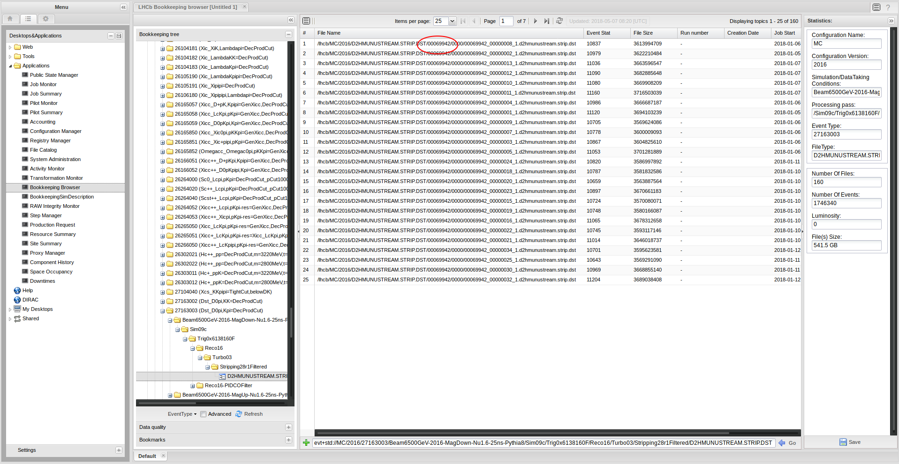


* Find the correct option files to run Gauss
* Produce generator level Monte Carlo, print the decay tree and produce nTuples
 

## Which option files to use and how to run Gauss

Imagine you need to know the option files and software versions used for a simulated sample you have found in the bookkeeping, e.g.
```
/MC/2016/Beam6500GeV-2016-MagDown-Nu1.6-25ns-Pythia8/Sim09c/Trig0x6138160F/Reco16/Turbo03/Stripping28r1Filtered/27163003/D2HMUNUSTREAM.STRIP.DST
```
First, find the ProductionID:



Search for this ID in the Transformation Monitor, right click the result and select "Show request". Right clicking and selecting "View" in the new window will open an overview about all the individual steps of the production with their application version and option files used.


`'$DECFILESROOT/options/{eventnumber}.py' '$LBPYTHIA8ROOT/options/Pythia8.py'` 
produces the sample using Pythia 8 while `'$LBPYTHIA8ROOT/options/Pythia8.py' 
'$DECFILESROOT/options/{eventnumber}.py'` uses Pythia 6.


## Running Gauss and create a generator-only sample

The production system handles the necessary settings for initial event- and runnumber and the used database tags. In a private production, you need to set these yourself in an additional options file, containing, for example:
```python
from Gauss.Configuration import GenInit

GaussGen = GenInit("GaussGen")
GaussGen.FirstEventNumber = 1
GaussGen.RunNumber = 1082

from Configurables import LHCbApp
LHCbApp().DDDBtag = 'dddb-20170721-3'
LHCbApp().CondDBtag = 'sim-20170721-2-vc-md100'
LHCbApp().EvtMax = 5
```

Assuming this is saved in a file called `Gauss-Job.py` and following the example above, the sample can then be produced by running

```shell
./run gaudirun.py 
        '$APPCONFIGOPTS/Gauss/Beam6500GeV-md100-2016-nu1.6.py' \  # Sets beam energy and position
        '$APPCONFIGOPTS/Gauss/EnableSpillover-25ns.py' \  # Enables spillover (only Run2)
        '$APPCONFIGOPTS/Gauss/DataType-2016.py' \
        '$APPCONFIGOPTS/Gauss/RICHRandomHits.py' \  # Random hits in RICH for occupancy
        '$DECFILESROOT/options/{eventnumber}.py' \  # Event type containing the signal
        '$LBPYTHIA8ROOT/options/Pythia8.py' \  # Setting Pythia8 as generator
        '$APPCONFIGOPTS/Gauss/G4PL_FTFP_BERT_EmNoCuts.py' \  # Physics simulated by Geant4
        Gauss-Job.py
```


The detector simulation is slow, to only run the generator phase, add `'$GAUSSOPTS/GenStandAlone.py'` as one of the option files.


In this case, the options simplify to :
```shell
./run gaudirun.py 
        '$APPCONFIGOPTS/Gauss/Beam6500GeV-md100-2016-nu1.6.py' \  # Sets beam energy and position
        '$GAUSSOPTS/GenStandAlone.py' \  # Deactivates the detector simulation
        '$DECFILESROOT/options/{eventnumber}.py' \  # Event type containing the signal
        '$LBPYTHIA8ROOT/options/Pythia8.py' \  # Setting Pythia8 as generator
        Gauss-Job.py
```


You can source the various options files from your `'Gauss-Job.py'` by adding at its top:
```python
from Gaudi.Configuration import *
importOptions("$APPCONFIGOPTS/Gauss/Beam6500GeV-md100-2016-nu1.6.py")
# etc ...
```


See if you can generate a generator level only sample for event type `27175000` ( $$D^{*+} \to D^{0}(\to K^{+}K^{-}\mu^{+}\mu^{-})\pi^{+}$$ )

## Make an nTuple

The `.xgen` file can be processed into something more usable (copied together from [here](https://gitlab.cern.ch/lhcb-datapkg/Gen/DecFiles/blob/master/CONTRIBUTING.md)).
A larger input file containing 50,000 generated events for event-type can be found on EOS: `root://eosuser.cern.ch//eos/user/l/lhcbsk/sim-lesson-2019/Gauss-27175000-50000ev-20190515.xgen`.
```python
"""Configure the variables below with:
decay: Decay you want to inspect, using 'newer' LoKi decay descriptor syntax,
decay_heads: Particles you'd like to see the decay tree of,
datafile: Where the file created by the Gauss generation phase is, and
year: What year the MC is simulating.
"""
# https://twiki.cern.ch/twiki/bin/view/LHCb/FAQ/LoKiNewDecayFinders
decay = "[D*(2010)+ ==> ^(D0 ==> ^K+ ^K- ^mu+ ^mu-) ^pi+]CC"
datafile = # THE INPUT FILE

mc_basic_loki_vars = {
    'ETA': 'MCETA',
    'PHI': 'MCPHI',
    'PT': 'MCPT',
    'PX': 'MCPX',
    'PY': 'MCPY',
    'PZ': 'MCPZ',
    'E': 'MCE',
    'P': 'MCP',
}

from Configurables import (
    DaVinci,
    MCDecayTreeTuple
)
from DecayTreeTuple.Configuration import *

# For a quick and dirty check, you don't need to edit anything below here.
##########################################################################

# Create an MC DTT containing any candidates matching the decay descriptor
mctuple = MCDecayTreeTuple("MCDecayTreeTuple")
mctuple.Decay = decay

mctuple.ToolList = []
mctuple.addTupleTool(
    'LoKi::Hybrid::MCTupleTool/basicLoKiTT'
).Variables = mc_basic_loki_vars

# Name of the .xgen file produced by Gauss
from GaudiConf import IOHelper
# Use the local input data
IOHelper().inputFiles([
    datafile
], clear=True)

# Configure DaVinci
DaVinci().TupleFile = "DVntuple.root"
DaVinci().Simulation = True
DaVinci().Lumi = False
DaVinci().DataType = '2016'
DaVinci().InputType = 'DIGI'
DaVinci().UserAlgorithms = [mctuple]

from Gaudi.Configuration import appendPostConfigAction
def doIt():
    """
    specific post-config action for (x)GEN-files
    """
    extension = "xgen"
    ext = extension.upper()

    from Configurables import DataOnDemandSvc
    dod  = DataOnDemandSvc ()
    from copy import deepcopy
    algs = deepcopy ( dod.AlgMap )
    bad  = set()
    for key in algs :
        if     0 <= key.find ( 'Rec'     )                  : bad.add ( key )
        elif   0 <= key.find ( 'Raw'     )                  : bad.add ( key )
        elif   0 <= key.find ( 'DAQ'     )                  : bad.add ( key )
        elif   0 <= key.find ( 'Trigger' )                  : bad.add ( key )
        elif   0 <= key.find ( 'Phys'    )                  : bad.add ( key )
        elif   0 <= key.find ( 'Prev/'   )                  : bad.add ( key )
        elif   0 <= key.find ( 'Next/'   )                  : bad.add ( key )
        elif   0 <= key.find ( '/MC/'    ) and 'GEN' == ext : bad.add ( key )

    for b in bad :
        del algs[b]

    dod.AlgMap = algs

    from Configurables import EventClockSvc, CondDB
    EventClockSvc ( EventTimeDecoder = "FakeEventTime" )
    CondDB  ( IgnoreHeartBeat = True )

appendPostConfigAction( doIt )
```
